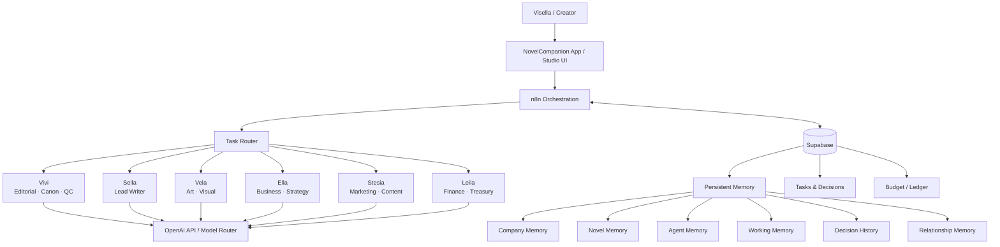

# NovelCompanion Architecture

NovelCompanion is designed as a small AI studio rather than a single general-purpose assistant.

## High-level architecture

## Roles

| Worker | Primary responsibility |
| --- | --- |
| **Vivi** | Editorial review, canon protection, novel health, consistency, quality control |
| **Sella** | Drafting, scene writing, dialogue, chapter work, revision |
| **Vela** | Visual direction, covers, concepts, presentation |
| **Ella** | Business decisions, product direction, strategy |
| **Stesia** | Marketing, content planning, positioning, distribution |
| **Leila** | Finance, treasury, budget and ledger awareness |

The creator remains the studio CEO and final authority.

## Orchestration layer

**n8n** is the workflow layer.

Responsibilities:

- Receive task requests.
- Normalize task input.
- Select or respect the requested worker.
- Apply budget / model rules.
- Call the model layer.
- Persist useful outputs and decisions.
- Return a structured response to the client.
- Handle retry-safe integrations without duplicating important writes.

The orchestration layer should stay thin enough that business rules remain understandable and testable.

## Model routing

NovelCompanion uses tiered model selection:

- **LOW** — simple classification, formatting, light extraction, routine tasks.
- **STANDARD** — normal writing, analysis, planning, and most worker activity.
- **HIGH** — difficult editorial reasoning, architecture, complex planning, or high-value decisions.

The router should prefer the lowest tier that can complete the task reliably.

## Persistent data

**Supabase** is the planned durable data layer.

Important data families:

### Company memory
Studio identity, constitution, operating rules, organization-level facts.

### Novel memory
Canon, characters, timeline, locations, relationships, plot decisions, unresolved threads.

### Agent memory
Worker-specific knowledge, role boundaries, lessons, and operating preferences.

### Working memory
Short-lived task context needed to complete active work.

### Decision history
Important choices, rationale, alternatives, and approval history.

### Relationship memory
Persistent interpersonal or role-specific context that should survive across sessions.

## Governance

NovelCompanion separates action authority into four broad classes:

1. **Forbidden** — must not be performed.
2. **Ask first** — requires explicit creator approval.
3. **Authorized** — may proceed within defined limits.
4. **Standing permission** — recurring permission already granted for a narrow scope.

Sensitive, expensive, destructive, or irreversible actions should always remain visible and auditable.

## Finance and cost control

The studio keeps a separate virtual operating ledger.

Model usage should eventually record:

- worker,
- selected model tier,
- task category,
- estimated / actual cost,
- approval requirement,
- result status.

This keeps AI usage from becoming an invisible operational expense.

## Client boundary

The Android app should act as a client of the studio system rather than becoming the place where all business logic lives.

That separation makes it easier to:

- change model providers,
- replace orchestration,
- add a web client,
- test workflows independently,
- keep credentials out of the mobile app.

## Repository direction

The current repository still uses a ZIP-based Android build input. This is a transitional packaging format.

The long-term target is a normal checked-in source tree with:

- application source,
- documentation,
- CI,
- tests,
- migration history,
- release metadata,

all versioned directly in Git.
